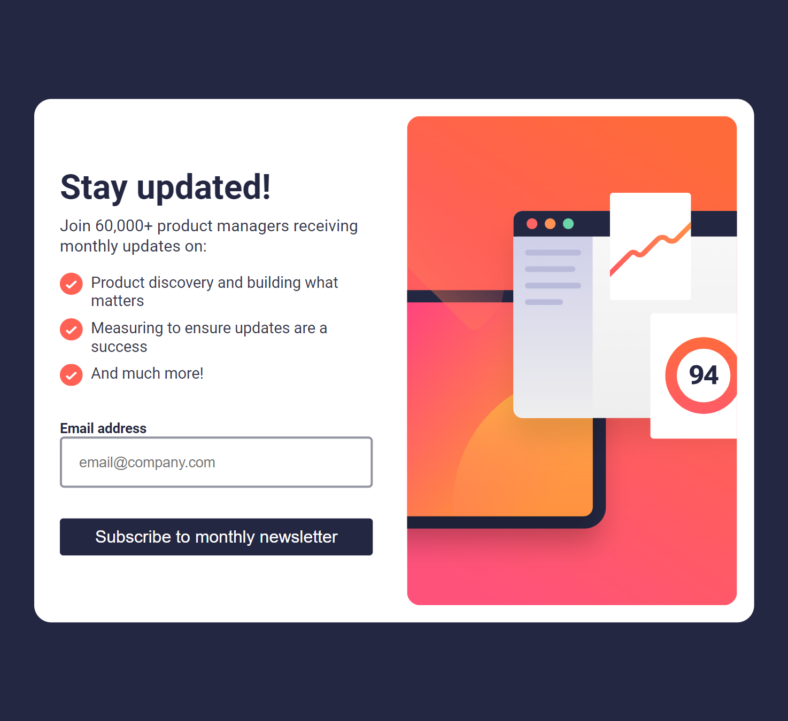

# Frontend Mentor - Newsletter sign-up form with success message solution

This is a solution to the [Newsletter sign-up form with success message challenge on Frontend Mentor](https://www.frontendmentor.io/challenges/newsletter-signup-form-with-success-message-3FC1AZbNrv). Frontend Mentor challenges help you improve your coding skills by building realistic projects. 

### The challenge

Users should be able to:

- Add their email and submit the form
- See a success message with their email after successfully submitting the form
- See form validation messages if:
  - The field is left empty
  - The email address is not formatted correctly
- View the optimal layout for the interface depending on their device's screen size
- See hover and focus states for all interactive elements on the page

### Screenshot

### Links

- Solution URL: [Add solution URL here](https://github.com/Stephanie0905/Newsletter_js)
- Live Site URL: [Add live site URL here](https://stephanie0905.github.io/Newsletter_js/)

## My process

### Built with

- HTML5 
- CSS 
- Flexbox
- CSS Grid
- DOM Javascript

### Useful resources

- [w3schools](https://www.w3schools.com/) - This helped me for XYZ reason. I really liked this pattern and will use it going forward.
- [freecodecamp](https://www.freecodecamp.org/news/build-and-validate-beautiful-forms-with-vanilla-html-css-js/) - This is an amazing article which helped me finally understand XYZ. I'd recommend it to anyone still learning this concept.

